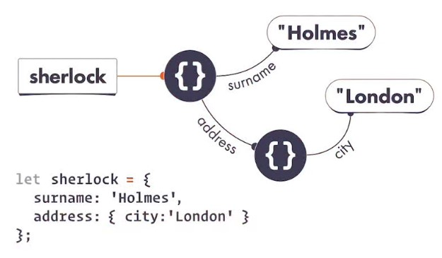
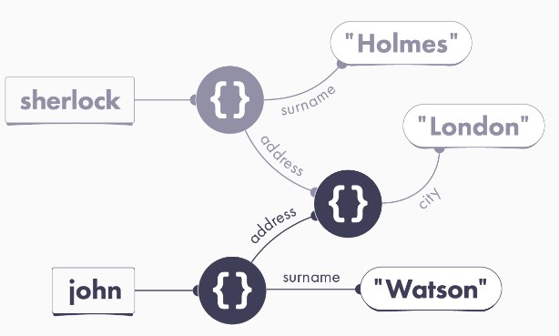
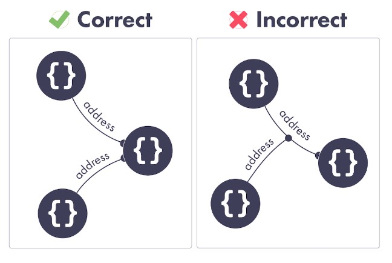
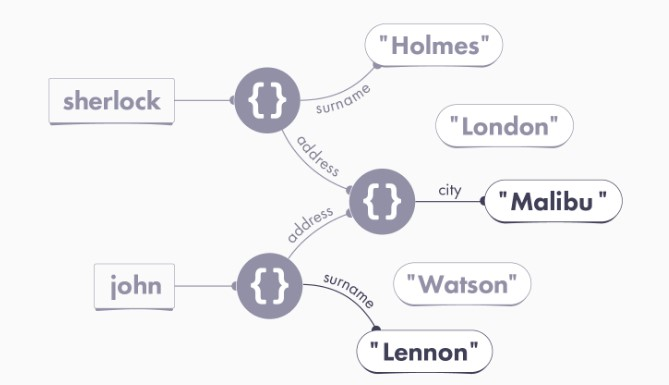
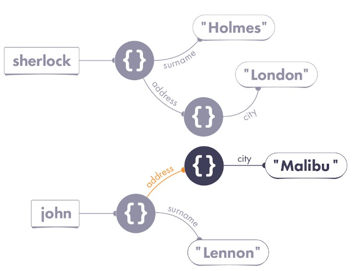

# Mutation

Step by step in the sherlock case.

## Step 1: Declaring the sherlock Variable

```js
let sherlock = {
  surname: "Holmes",
  address: { city: "London" },
};
```



### No Nested Objects

- Objects might appear “nested” in code, but in our universe, each object is completely separate. An object cannot be “inside” of another object!

## Step 2: Declaring the john Variable

```js
let john = {
  surname: "Watson",
  address: sherlock.address,
};
```



### Properties Always Point to Values

We see address: sherlock.address, it is tempting to think that John’s address property points to Sherlock’s address property.

**Remember: a property always points to a value! It can’t point to another property or a variable. In general, all wires in our universe point to values.**



## Step 3: Changing the Properties

```js
john.surname = 'Lennon';
john.address.city = 'Malibu';`
```



## Mutation

```js
john.surname = "Lennon";
john.address.city = "Malibu";
```

- First line mutates the object `john` points to`.
- Seconde line is very diferent, doesnt mutate the object `john`, mutates the object that can reach by `john.address`.

_This is why the intuition of objects being “nested” is so wrong! It makes us forget that there may be many objects pointing to the object we changed._

### Possible Solution: Mutating Another Object

```js
john.surname = "Lennon";
john.address = { city: "Malibu" };
```

The difference in the second line is very imoprtant. With `john.address = { city: 'Malibu' }` we are mutatiind the `address` property that john points to.



### Alternative Solution: No Object Mutation

```js
john = {
  surname: "Lennon",
  address: { city: "Malibu" },
};
```

### Let vs. Const

```js
const shrek = { species: "ogre" };

shrek = fiona; // TypeError

shrek.species = "human";
console.log(shrek.species); // 'human'
```

- const prevents variable reassignment—not object mutation

### Is Mutation Bad?

- By the time you mutate an object, variables and properties may already be pointing to it. Your mutation affects any code “following” those wires later.
