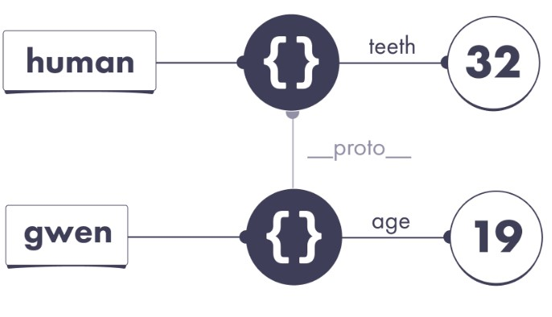
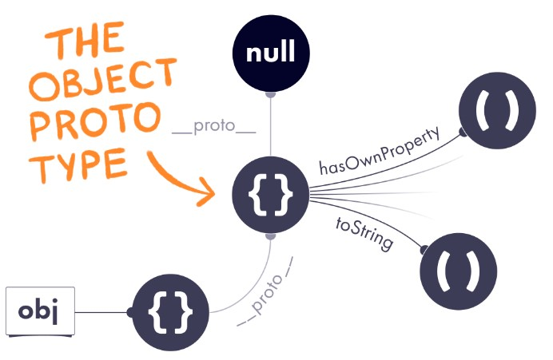

# Prototypes

How is this possible?

```js
let pizza = {};
console.log(pizza.taste); // "pineapple"
```

## Prototypes

```js
let human = {
  teeth: 32,
};

let gwen = {
  age: 19,
};

console.log(gwen.teeth); // undefined

let gwen = {
  // We added this line:
  __proto__: human,
  age: 19,
};
```



What is that mysterious `__proto__` property?

It represents the JavaScript concept of a prototype. Any JavaScript object may choose another object as a prototype.

By specifying **proto** (also known as our object’s prototype), we instruct JavaScript to continue looking for missing properties on that object instead.

### Prototypes in Action

1. Follow the `gwen` wire to an object
2. `teeth` property?
   - No.
   - But it has a prototype, let's check.
3. That object have a `teeth` property?
   - Yes, points to `32`
   - Therefore, the result of `gwen.teeth` is `32`

#### Answers

```js
let human = {
  teeth: 32,
};

let gwen = {
  __proto__: human,
  age: 19,
};

console.log(human.age); // undefined
console.log(gwen.age); // 19

console.log(human.teeth); // 32
console.log(gwen.teeth); // 32

console.log(human.tail); // undefined
console.log(gwen.tail); // undefined
```

### The Prototype Chain

```js
let mammal = {
  brainy: true,
};

let human = {
  __proto__: mammal,
  teeth: 32,
};

let gwen = {
  __proto__: human,
  age: 19,
};

console.log(gwen.brainy); // true
```

### Shadowing

```js
let human = {
  teeth: 32,
};

let gwen = {
  __proto__: human,
  // This object has its own teeth property:
  teeth: 31,
};

console.log(human.teeth); // 32
console.log(gwen.teeth); // 31

console.log(human.hasOwnProperty("teeth")); // true
console.log(gwen.hasOwnProperty("teeth")); // true
```

- Once we find our property, we stop the search.

### Assignment

```js
let human = {
  teeth: 32,
};

let gwen = {
  __proto__: human,
  // Note: no own teeth property
};

gwen.teeth = 31;

console.log(human.teeth); // 32
console.log(gwen.teeth); // 31
```

### The Object Prototype



```js
let human = {
  teeth: 32,
};
console.log(human.hasOwnProperty); // (function)
console.log(human.toString); // // (function)
```

### An Object With No Prototype

```js
let weirdo = {
  __proto__: null,
};

console.log(weirdo.hasOwnProperty); // undefined
console.log(weirdo.toString); // undefined
```

This will produce an object that truly doesn’t have a prototype at all.

### Why Does This Matter?

In practice, you probably won’t use prototypes in your code directly.
