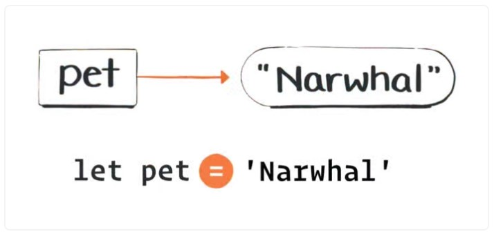
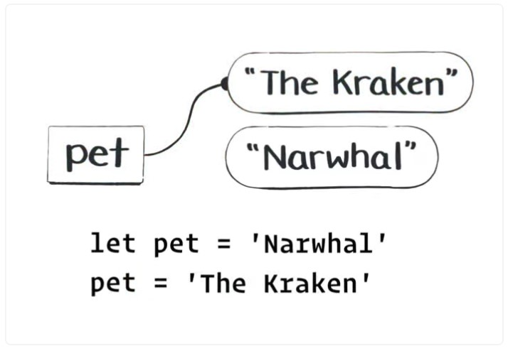

# Values and Variables

```js
let reaction = "yikes";
reaction[0] = "l";
console.log(reaction);
// Prints yikes or throw error depending on strict mode
```

## Primitive Values Are Immutable

```js
let arr = [212, 8, 506];
let str = "hello";
console.log(arr[0]); // 212
console.log(str[0]); // "h"
```

We can access the array first item and string first letter, but we can't change the string letter in this way, because we can’t change primitive values.

## Variables and Values—A Contradiction?

```js
let pet = "Narwhal";
pet = "The Kraken";
console.log(pet); // ? "The kraken"
```

- Immutability doesn’t play a role here.

## Variables Are Wires

We said primitive _values_ can’t change, but we didn’t say anything about _variables_!

- Variables are not values.
- Variables point to values.

### Assigning a Value to a Variable

```js
let pet = "Narwal";
pet = "The Kraken";
```




### Rules of Assignment

- The left side must me a "Wire" - such as pet

```js
20000 = 'leagues under the sea'; // Nope.
'war' = 'peace'; // Nope.
```

- The right side must be an expression, that aways results in a value;

```js
pet = count + " Dalmatians";
```

### Nitpicking

```js
function double(x) {
  x = x * 2;
}

let money = 10;
double(money);
console.log(money); // ?
```

The thought that `double(money)` will double the money is not correct. `double(money)` means "figure out the value of money", and than pass that value to double. So money still points to 10.

## Putting it Together

```js
let x = 10;
let y = x;
x = 0;
```

- x is assigned to 10
- y is assigned to the value of x, so 10
- x is assigned to 0, but y maintain assigned to 10

**We can’t point variables to each other! Variables always point to values. **
